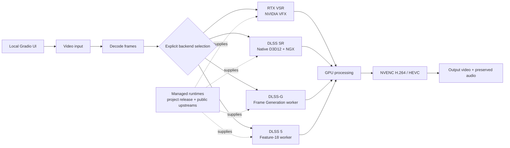

<div align="center">

# NVIDIA Video Enhancer

**A local Windows workbench for NVIDIA-powered video enhancement.**

Preview frames, preview clips, and render complete videos through four primary GPU backend families. Your media stays on your machine.

[](https://www.microsoft.com/windows)
[](https://www.python.org/)
[](https://www.nvidia.com/geforce/graphics-cards/)
[](#security-model)
[](LICENSE)

**Unofficial community project. Not affiliated with or endorsed by NVIDIA.**

</div>

<div align="center">
  
</div>

## Choose Your Backend

The backends are selected explicitly. If a required runtime is unavailable or incompatible, that backend reports diagnostics and stops; it never silently switches to another processor.

| Backend | Best for | Starting point | Setup |
| --- | --- | --- | --- |
| **RTX Video Super Resolution** | Ordinary video, compression artifacts, practical cleanup | 2× · ULTRA | Automatic environment setup; hardware/driver dependent |
| **DLSS Super Resolution** | Temporal super resolution through a native D3D12 host | Quality · Default model | Host/runtime bootstrap + self-test are automatic |
| **DLSS Frame Generation** | Temporal interpolation through the DLSS-G worker | 2× / 3× / 4× | Worker, validated legacy SM86 runtime, and NVIDIA provider are downloaded automatically |
| **DLSS 5 Neural Rendering** | CGI-like or AI-generated content where reinterpretation is acceptable | 1× native · Natural | Compatible v3 runtime download + Feature-18 self-test are automatic; experimental |

### What each one does

- **RTX VSR** reconstructs and cleans up conventional video through NVIDIA's RTX Video SDK.
- **DLSS SR** runs standalone NVIDIA NGX DLSS Super Resolution with DIS optical-flow guidance. It is not a game integration and does not receive engine motion vectors.
- **DLSS-G** generates intermediate frames from consecutive decoded frames using NVIDIA Optical Flow and the Ampere-compatible DLSS-G runtime; it is frame generation, not an upscaler.
- **DLSS 5** uses a local Feature-18 worker/runtime. It is a neural rendering experiment, not a conventional detail-preserving upscaler; faces, materials, and lighting may be reinterpreted.

## Highlights

- Local Gradio UI bound to `127.0.0.1` with no public share link
- Before/after frame preview and short clip preview
- Full-video rendering with progress, GPU/VRAM monitoring, and cancellation
- H.264 or HEVC NVENC output in MP4, MKV, or MOV containers
- Audio preservation through the video render pipeline
- Saved settings and presets for each backend
- Automatic source setup for runtime components that have stable public upstream download locations
- Runtime diagnostics and functional self-tests instead of manual approval manifests
- No backend fallback: an incompatible backend fails independently without blocking the others

## Architecture



## Quick Start

### Current source checkout (recommended)

Prerequisites: Windows 10/11 x64, a compatible NVIDIA RTX GPU/driver, Miniconda or Anaconda, FFmpeg/FFprobe with NVENC on `PATH`, Git, and the Microsoft Visual C++ 2015-2022 Redistributable x64.

From a Git-enabled terminal:

```bat
git clone --recurse-submodules https://github.com/jyu041/dlss-rtxsr-upscaler.git
cd dlss-rtxsr-upscaler
setup.bat
start.bat
```

`setup.bat` now automates the runtime work that can be automated. It prepares the Conda environment, checks FFmpeg/NVENC, and then obtains the supported runtime pieces directly from pinned public sources:

- project C55 DLSS-G worker and DLSS SR host/runtime from this project's public `v0.1.0-beta.2` release;
- the validated legacy SM86 DLSS-G runtime directly from the pinned `sdli1995/dlssg_for_sm86` GitHub commit;
- the pinned NVIDIA DLSS-G provider directly from NVIDIA's Streamline GitHub release;
- the compatible DLSS 5 Visual Enhancer v3.0 runtime directly from its upstream GitHub release.

Integrity checks are automatic. Users do not create approval manifests or manually copy hashes. The setup script also runs the DLSS SR self-test and, when the DLSS 5 runtime is present, the Feature-18 self-test automatically. If an optional upstream download is temporarily unavailable or a backend is unsupported by the installed GPU/driver, setup continues and that backend is reported as unavailable rather than breaking the rest of the application.

The DLSS 5 worker firewall rule is **optional**. Users who prefer to block that third-party worker's outbound network access can configure a Windows Firewall rule themselves; the application reports it diagnostically but does not require it for backend readiness.

Open the printed localhost URL, upload an owned or synthetic test video, choose one backend, preview a frame or clip, and then render. Start with the defaults shown in the comparison table before tuning a backend.

### Existing beta package

The public `v0.1.0-beta.2` release remains available as the validated pre-Phase-5 beta package. It contains the C55 worker, DLSS SR host, and validated official DLSS SR runtime, but its application source predates the current `main` branch. New users should prefer the current source-checkout workflow above.

The detailed developer setup is documented in [`docs/DEVELOPMENT.md`](docs/DEVELOPMENT.md). Backend-specific runtime and troubleshooting details are covered in [`docs/INSTALL.md`](docs/INSTALL.md).

## Requirements By Backend

| Backend | Additional requirement after `setup.bat` |
| --- | --- |
| RTX VSR | Compatible NVIDIA GPU/driver and working NVIDIA VFX package |
| DLSS SR | Automatic self-test must pass on the machine |
| DLSS-G | Compatible NVIDIA GPU/driver; the standard validated legacy runtime/provider path is installed automatically |
| DLSS 5 | Compatible GPU/driver and a successful automatic Feature-18 self-test; the backend remains experimental |

No private repository access is required by users. If a future runtime cannot be obtained automatically because its vendor requires a manual SDK/license download, that exception will be stated explicitly here and in `docs/INSTALL.md` rather than hidden behind an application approval process.

Backend availability still depends on the installed GPU, driver, and exact runtime combination. RTX 30/40/50-series hardware may expose different capabilities; community execution does not establish official NVIDIA support on every GPU.

## Security Model

This project is designed for local processing with straightforward runtime handling:

- The UI binds to localhost and does not enable Gradio sharing.
- `setup.bat` downloads only the runtime components that have known public HTTPS upstream locations. Project-owned binaries come from this project's public release; third-party binaries are downloaded directly from their upstream projects rather than re-hosted here.
- Download integrity checks are automatic where a stable release digest or exact pinned identity is available. They are implementation details, not user approval steps.
- There is no manual DLSS 5 approval manifest requirement and no mandatory Windows Firewall rule.
- Runtime compatibility is determined by functional readiness/self-tests and backend diagnostics.
- Missing or incompatible runtimes fail only the affected backend; the application does not silently switch processing methods.

Read the full audit in [`docs/SECURITY_AUDIT.md`](docs/SECURITY_AUDIT.md).

## Limitations

- The current pipeline targets SDR RGBA video.
- DLSS SR uses estimated optical flow rather than engine-provided motion vectors and may fail around cuts, occlusion, hair, and transparency.
- The validated production DLSS-G path is currently 2×/3×/4× through the frozen C55 worker and validated legacy SM86 runtime. The newer 0.3.1 runtime remains a separate candidate path.
- DLSS 5 is experimental, hardware- and runtime-dependent, and may alter semantic content. On the validated RTX 30 v3 pair, output scaling above 1× remains disabled because that exact combination reproducibly falls back rather than providing verified Feature-18 output.
- The newer DLSS5 Neuroframe v9 integration remains a separate static candidate and is not substituted for the validated v3 protocol path during normal setup.
- Performance and output quality vary substantially by source media, codec, resolution, driver, and backend runtime.
- Third-party runtime binaries retain their own licenses and are not covered by this repository's MIT license.

## Tested Hardware

Primary development and hardware validation has been performed on:

- Phase 4C / beta.2 validation: NVIDIA GeForce RTX 3070 Ti 8 GB, Windows 11 build 26200, NVIDIA driver 610.62
- Other development testing also includes RTX 3070 where separately documented.

This is a development and validation configuration, not a minimum requirement or a claim of official NVIDIA support for every backend. Backend availability depends on the installed GPU, driver, and exact runtime combination. GPU smoke tests count as validation only when the relevant runtime is actually present and the functional check passes.

For the validation classes and commands, see [`docs/TESTING.md`](docs/TESTING.md). A skipped hardware test is not a successful backend validation.

## Project Structure

```text
src/                    Python application and video pipelines
native/dlss_sr_host/    Standalone D3D12 DLSS SR host
tests/                  Deterministic and explicit hardware tests
docs/                   Installation, architecture, security, and runtime notes
third_party/            Retained protocol dependency and local SDK staging area
tools/                   Runtime/bootstrap and validation tools
setup.bat               Conda environment + automatic runtime setup
start.bat               Local UI launcher
```

## Documentation

- [`docs/INSTALL.md`](docs/INSTALL.md) - installation and backend setup
- [`docs/ARCHITECTURE.md`](docs/ARCHITECTURE.md) - pipeline and host architecture
- [`docs/SECURITY_AUDIT.md`](docs/SECURITY_AUDIT.md) - security and runtime policy
- [`docs/TESTING.md`](docs/TESTING.md) - deterministic and hardware validation
- [`docs/THIRD_PARTY.md`](docs/THIRD_PARTY.md) - dependency and retained-source licensing
- [`CONTRIBUTING.md`](CONTRIBUTING.md) - development and contribution guidelines

## Acknowledgements

This project uses the following software and technologies; acknowledgement does not imply endorsement:

- NVIDIA for RTX Video Super Resolution, NGX DLSS, Streamline, and related developer technologies
- `sdli1995/dlssg_for_sm86` for the Ampere-compatible community DLSS-G runtime
- Merserk's DLSS 5 Visual Enhancer for the third-party runtime driven by the retained protocol client
- The maintainers of the retained [`ComfyUI-DLSS5-Enhancer`](third_party/ComfyUI-DLSS5-Enhancer) protocol client
- FFmpeg for media decoding, encoding, and muxing
- Gradio for the local UI
- OpenCV for image and frame processing
- PyTorch for tensor and CUDA operations

The project does not re-host the external community DLSS-G or DLSS 5 Visual Enhancer runtime archives during source setup; `setup.bat` downloads those files directly from their public upstream locations. Project-owned source remains MIT; third-party components retain their respective terms.

## License

Project-owned source is released under the [MIT License](LICENSE). Third-party components and proprietary runtimes retain their respective licenses. See [`docs/THIRD_PARTY.md`](docs/THIRD_PARTY.md) for the inventory.
