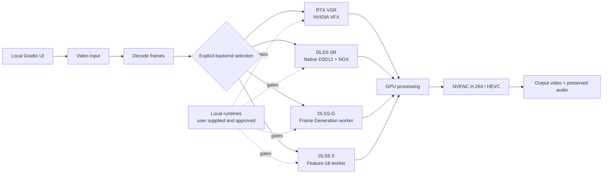

<div align="center">

# NVIDIA Video Enhancer

**A local Windows workbench for NVIDIA-powered video enhancement.**

Preview frames, preview clips, and render complete videos through four primary GPU backend families. Your media stays on your machine.

[](https://www.microsoft.com/windows)
[](https://www.python.org/)
[](https://www.nvidia.com/geforce/graphics-cards/)
[](#security-model)
[](LICENSE)

**Unofficial community project. Not affiliated with or endorsed by NVIDIA.**

</div>

<div align="center">
  
</div>

## Choose Your Backend

The backends are selected explicitly. If a required runtime is missing or unapproved, that backend reports diagnostics and stops; it never silently switches to another processor.

| Backend | Best for | Starting point | Status |
| --- | --- | --- | --- |
| **RTX Video Super Resolution** | Ordinary video, compression artifacts, practical cleanup | 2× · ULTRA | Runtime-dependent |
| **DLSS Super Resolution** | Temporal super resolution through a native D3D12 host | Quality · Default model | Runtime-dependent |
| **DLSS Frame Generation** | Temporal interpolation through the DLSS-G worker | 2× / 3× / 4× | User-supplied runtime |
| **DLSS 5 Neural Rendering** | CGI-like or AI-generated content where reinterpretation is acceptable | 1× native · Natural | Experimental |

### What each one does

- **RTX VSR** reconstructs and cleans up conventional video through NVIDIA's RTX Video SDK.
- **DLSS SR** runs standalone NVIDIA NGX DLSS Super Resolution with DIS optical-flow guidance. It is not a game integration and does not receive engine motion vectors.
- **DLSS-G** generates intermediate frames from consecutive decoded frames using NVIDIA Optical Flow and a user-supplied external runtime; it is frame generation, not an upscaler.
- **DLSS 5** uses a separately supplied local Feature-18 worker. It is a neural rendering experiment, not a conventional detail-preserving upscaler; faces, materials, and lighting may be reinterpreted.

## Highlights

- Local Gradio UI bound to `127.0.0.1` with no public share link
- Before/after frame preview and short clip preview
- Full-video rendering with progress, GPU/VRAM monitoring, and cancellation
- H.264 or HEVC NVENC output in MP4, MKV, or MOV containers
- Audio preservation through the video render pipeline
- Saved settings and presets for each backend
- Separate runtime checks, diagnostics, manifests, hashes, and approval gates
- No backend fallback, silent runtime downloads, or unapproved proprietary binaries

## Architecture



## Quick Start

### Current source checkout (recommended)

Prerequisites: Windows 10/11 x64, a compatible NVIDIA RTX GPU/driver, Miniconda or Anaconda, FFmpeg/FFprobe with NVENC on `PATH`, and the Microsoft Visual C++ 2015-2022 Redistributable x64.

From a Git-enabled terminal:

```bat
git clone --recurse-submodules https://github.com/jyu041/dlss-rtxsr-upscaler.git
cd dlss-rtxsr-upscaler
setup.bat
start.bat
```

`setup.bat` prepares the dedicated Conda environment, verifies FFmpeg/NVENC, and explicitly bootstraps the validated project-owned C55 DLSS-G worker plus the validated DLSS SR host/runtime from this project's public `v0.1.0-beta.2` GitHub release. The release archive and extracted identities are pinned by SHA-256; the private resources repository is not required by users.

The setup step does **not** silently obtain the external community/official DLSS-G runtimes or DLSS 5 runtime. Those remain explicit Runtime Manager or user-supplied components because they have separate upstream/licensing requirements.

Open the printed localhost URL, upload an owned or synthetic test video, choose one backend, preview a frame or clip, and then render. Start with the defaults shown in the comparison table before tuning a backend.

### Existing beta package

The public `v0.1.0-beta.2` release remains available as the validated pre-Phase-5 beta package. It already contains the C55 worker, DLSS SR host, and validated official DLSS SR runtime, but its application source predates the current `main` branch. New users should prefer the current source-checkout workflow above.

The detailed developer setup is documented in [`docs/DEVELOPMENT.md`](docs/DEVELOPMENT.md). NVIDIA VFX, local DLSS SDK staging, and optional DLSS 5 approval requirements are covered in [`docs/INSTALL.md`](docs/INSTALL.md).

## Requirements By Backend

| Backend | Additional local requirement |
| --- | --- |
| RTX VSR | Compatible official NVIDIA VFX package installed by the environment setup |
| DLSS SR | Validated host/runtime are bootstrapped from the project's public Beta.2 release; first-use local self-test remains required |
| DLSS-G | C55 worker is bootstrapped publicly; compatible community/official runtime remains explicit and separately supplied/installed |
| DLSS 5 | Retained protocol client, separately obtained runtime, approved manifest, exact hashes, signed Feature-18 evidence, and the required Windows Firewall outbound block |

Backend availability depends on the installed GPU, driver, and exact runtime combination. RTX 30/40/50-series hardware may expose different capabilities; DLSS 5 support must not be inferred from community experiments alone. See [`docs/DLSS5_APPROVAL.md`](docs/DLSS5_APPROVAL.md) for the approval contract.
