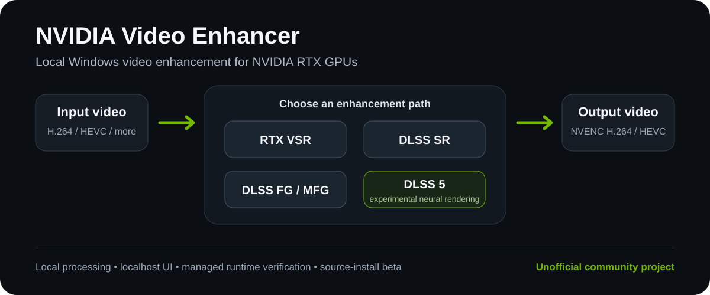

<div align="center">

# NVIDIA Video Enhancer

**Local Windows video enhancement for NVIDIA RTX GPUs.**

Run RTX Video Super Resolution, standalone DLSS Super Resolution, DLSS Frame
Generation, and experimental DLSS 5 Neural Rendering from one localhost UI.

[](https://github.com/jyu041/dlss-rtxsr-upscaler/releases)
[](https://www.microsoft.com/windows)
[](https://www.python.org/)
[](https://www.nvidia.com/geforce/graphics-cards/)
[](#security-and-runtime-model)
[](LICENSE)

**Unofficial community project. Not affiliated with or endorsed by NVIDIA.**

</div>

<p align="center">
  
</p>

## At a glance

| | |
| --- | --- |
| **One local UI** | Upload, preview, configure, render, inspect diagnostics, and manage supported runtimes from the same localhost application. |
| **Four enhancement paths** | RTX VSR, standalone DLSS SR, DLSS Frame Generation / MFG, and experimental DLSS 5 Neural Rendering. |
| **Local processing** | Video processing stays on the Windows machine; the Gradio UI binds to `127.0.0.1` with public sharing disabled. |
| **Managed setup** | `setup.bat` creates the Conda environment, verifies prerequisites, provisions pinned runtimes, and performs readiness checks. |

## Current release

**v0.2.0-beta.3** is the current public-launch source beta.

The normal user workflow is intentionally simple:

```text
clone -> setup.bat -> start.bat
```

Setup provisions the managed backends into project-local runtime directories.
Normal users should not need to download DLLs manually, copy backend files
between repositories, or enter executable/runtime paths in the UI.

See the [v0.2.0-beta.3 release notes](docs/RELEASE_NOTES_v0.2.0-beta.3.md) for
the complete change list and validation scope.

## Supported modes

| Mode | What it does | Current status |
| --- | --- | --- |
| **RTX VSR** | Conventional denoise/deblur and super resolution through NVIDIA RTX Video | Normal supported path |
| **DLSS SR** | Standalone temporal super resolution through a local D3D12/NGX host | Managed and hardware-validated on the primary test system |
| **DLSS Frame Generation** | 2X/3X/4X temporal interpolation | Validated C55 profile by default; faster grid4 profile remains experimental |
| **DLSS 5** | Experimental Neural Rendering with configurable quality/performance controls | Unified v10 path; hardware-validated on RTX 3070 Ti within the documented limits |

### DLSS 5

The application exposes **one DLSS 5 mode**. The preferred v10 runtime is
installed through the normal setup flow and selected automatically when ready.

The current DLSS 5 pipeline supports:

- 1-4 Neural Rendering passes;
- Auto / 100 / 87.5 / 75 / 67 / 50% neural working resolution;
- residual recomposition back onto the native-resolution source;
- CUDA-preferred or CPU recomposition;
- optional motion-compensated temporal residual stabilization;
- neural color strength and tone preservation;
- face/skin protection and grain preservation;
- native shimmer suppression; and
- optional NVIDIA Optical Flow preference.

One pass remains the conservative default. Higher pass counts produce a stronger
processed effect; they are not treated as a simple "higher is better" quality
setting.

DLSS 5 is experimental Neural Rendering rather than a conventional
detail-preserving upscaler. It can reinterpret faces, materials, lighting, and
other semantic content.

## Quick start

### Prerequisites

Install these before running setup:

- Windows 10/11 x64;
- a compatible NVIDIA RTX GPU and current NVIDIA driver;
- Git for Windows;
- Miniconda or Anaconda;
- FFmpeg and FFprobe with `h264_nvenc` and `hevc_nvenc`; and
- Microsoft Visual C++ 2015-2022 Redistributable x64.

For more detailed prerequisite and repair instructions, see
[Installation](docs/INSTALL.md).

### Install and launch

From PowerShell:

```powershell
git clone --recurse-submodules https://github.com/jyu041/dlss-rtxsr-upscaler.git
cd dlss-rtxsr-upscaler
.\setup.bat
.\start.bat
```

From Command Prompt, use `setup.bat` and `start.bat` without the leading
`.\`.

The first setup can take a while because it creates the Conda environment,
installs Python dependencies, downloads/verifies managed runtimes, and performs
local validation.

When setup reaches DLSS 5, it asks:

```text
Enable DLSS 5 now? [Y/N]
```

Choosing **Y** downloads or reuses the exact pinned v10 archive (about 690 MB),
verifies it, stages only the approved runtime payload, runs the Microsoft
Defender preflight, and verifies application readiness.

After setup succeeds, normal launches are simply:

```powershell
.\start.bat
```

The UI is served locally at:

```text
http://127.0.0.1:7860
```

## What setup manages

`setup.bat` handles the normal project-local environment and runtime layout:

1. creates or updates the dedicated `dlss-rtxsr-upscaler` Conda environment;
2. installs the pinned Python dependencies;
3. checks FFmpeg/FFprobe and NVENC availability;
4. installs and verifies the managed DLSS SR and DLSS-G components;
5. optionally provisions the preferred DLSS 5 v10 runtime;
6. performs the available local hardware/readiness checks;
7. runs diagnostics; and
8. records the resolved Conda executable for future `start.bat` launches.

A failure in one backend does not silently substitute a different enhancer.
Other independently validated modes remain usable.

For unattended setup:

```bat
set NVE_SETUP_DLSS5=1
setup.bat
```

Use `NVE_SETUP_DLSS5=0` to skip the DLSS 5 prompt.

If DLSS 5 later needs repair, use **Configuration -> DLSS 5 runtime -> Install /
Repair DLSS 5**. The verified v10 archive is cached locally so an expired
Defender preflight can normally be refreshed without another full download.

## Application layout

### Enhance

The normal workflow:

1. upload a video;
2. choose an enhancement mode;
3. configure that mode;
4. preview a frame or short clip; and
5. render the full output.

The renderer supports progress reporting, cancellation, last-render loading,
CPU/RAM/GPU/VRAM telemetry, audio preservation, and H.264 or HEVC NVENC output.

### Configuration

Contains runtime/readiness controls, reusable presets, managed-runtime
information, and explicit repair actions. These maintenance controls are kept
out of the normal rendering workflow.

### Diagnostics

Shows local hardware/runtime readiness and implementation diagnostics. It is
intended for troubleshooting and validation rather than normal rendering.

## Security and runtime model

Video processing is local. The UI binds to `127.0.0.1` and does not create a
public share link.

Network access is used for explicit setup/runtime-management actions such as
retrieving pinned backend artifacts. The normal application does not silently
download replacement runtimes at startup.

Managed components are checked against source-controlled identity policy before
activation. Missing or modified runtimes fail closed with diagnostics.

For DLSS 5 specifically:

- setup/user action is required before the preferred v10 runtime is installed;
- the complete upstream archive is pinned by exact size and SHA-256;
- only the allowlisted runtime payload is staged;
- a clean Microsoft Defender preflight is required;
- rendering runs through the isolated application path with process-tree and
  temporary outbound-firewall containment; and
- NGX/CUDA results and clean shutdown are validated.

The older v3 implementation is retained only as an internal compatibility path
for existing/manual legacy installations. It is not part of normal onboarding.

Generated runtime, cache, log, preview, input, and output directories are local
working data and are intentionally not tracked by Git.

A normal installation uses project-local paths such as:

```text
runtime/
├── dlss-sr-host/
├── dlssg/
│   ├── worker/
│   ├── grid4-worker/
│   ├── legacy/
│   └── official/
├── dlss5/
│   └── neuroframe-v10-candidate/
└── downloads/
    └── Visual.Enhancer.v10.0.zip
```

See [Security audit](docs/SECURITY_AUDIT.md) and
[DLSS 5 approval](docs/DLSS5_APPROVAL.md) for the detailed trust and execution
policy.

## Validation status

Primary hardware validation has been performed on **Windows 11 with an NVIDIA
GeForce RTX 3070 Ti 8 GB**.

Recorded evidence covers:

- DLSS-G 2X/3X/4X on the validated C55 path;
- the experimental grid4/GPU-resident NVOF candidate;
- the preferred DLSS 5 v10 application path through its documented
  1920x1080-equivalent / 1.0x boundary;
- reduced-resolution v10 processing and CUDA residual recomposition; and
- the unified clone -> setup -> start onboarding flow.

The reduced-resolution v10 matrix showed measurable steady-state throughput
gains on the tested clip, while the temporal residual stabilizer reduced the
diagnostic flicker metric at a significant CPU cost.

These results establish behavior for the tested configuration. They do **not**
claim universal RTX 30/40/50 compatibility, official NVIDIA support for the
experimental RTX 30-series paths, or perceptual superiority.

Key evidence:

- [Unified DLSS 5 v10 hardware validation](docs/DLSS5_UNIFIED_V10_HARDWARE_2026-09-21.md)
- [DLSS 5 v10 application hardware validation](docs/DLSS5_V10_APP_HARDWARE_2026-09-19.md)
- [Managed grid4 worker hardware validation](docs/MFG_GRID4_MANAGED_WORKER_HARDWARE_2026-09-19.md)
- [DLSS5 / MFG quality-performance campaign](docs/DLSS5_MFG_QUALITY_PERFORMANCE_2026-09-20.md)
- [Testing classes and commands](docs/TESTING.md)

## Current limitations

- The main video pipeline is SDR-focused.
- DLSS SR uses estimated optical flow rather than renderer motion vectors,
  depth, or jitter.
- C55 remains the validated DLSS-G default; grid4/GPU-resident NVOF remains
  experimental.
- DLSS 5 can materially reinterpret image content.
- The preferred DLSS 5 v10 path remains restricted to 1.0x output and the
  existing 1920x1080-equivalent native-input validation boundary.
- Reduced neural working resolution changes the internal neural workload, not
  final output dimensions or the validated native-input boundary.
- The current temporal residual stabilizer is CPU-heavy.
- Broader RTX 30/40/50 hardware and driver coverage remains future validation
  work.
- A no-Conda portable distribution is deliberately deferred.

See [Project status](docs/PROJECT_STATUS.md) for what is complete, deferred, or
hardware-dependent.

## Project structure

```text
src/                         Application, backend adapters, UI, and video pipelines
native/                      Project native host/worker source
tests/                       Unit, integration, and explicit hardware tests
docs/                        Installation, architecture, security, and validation evidence
third_party/                 Retained third-party source/submodule material
tools/                       Runtime management, validation, packaging, and developer tooling
config/                      Source-controlled defaults; generated local config is ignored
app.py                       Application entry point
setup.bat                    Source environment + managed runtime provisioning
start.bat                    Normal local UI launcher
environment.yml              Conda environment definition
requirements.txt             Primary Python dependency definition
```

## Documentation

| Document | Purpose |
| --- | --- |
| [Installation](docs/INSTALL.md) | Prerequisites, setup, and managed runtime provisioning |
| [Troubleshooting](docs/TROUBLESHOOTING.md) | Common installation and runtime failures |
| [Architecture](docs/ARCHITECTURE.md) | Current application/backend architecture |
| [Project status](docs/PROJECT_STATUS.md) | Completed scope, deferred work, and hardware-dependent expansion |
| [Testing](docs/TESTING.md) | Test classes and hardware-validation rules |
| [Security audit](docs/SECURITY_AUDIT.md) | Runtime trust and execution policy |
| [DLSS 5 approval](docs/DLSS5_APPROVAL.md) | Experimental DLSS 5 runtime approval contract |
| [Third-party inventory](docs/THIRD_PARTY.md) | Dependency and licensing inventory |
| [Changelog](CHANGELOG.md) | Concise release history |
| [Documentation index](docs/README.md) | Current docs vs historical engineering evidence |
| [Contributing](CONTRIBUTING.md) | Contributor workflow |

## Acknowledgements

This project uses NVIDIA RTX Video/NGX/Streamline technologies, FFmpeg, Gradio,
OpenCV, PyTorch, the retained
[ComfyUI-DLSS5-Enhancer](third_party/ComfyUI-DLSS5-Enhancer) protocol client, and
the pinned v10 runtime from
[Merserk/dlss5-visual-enhancer](https://github.com/Merserk/dlss5-visual-enhancer).
Acknowledgement does not imply endorsement.

The source repository does not bundle the external DLSS-G direct-host/provider
files or the upstream DLSS 5 runtime archive as ordinary Git content.
`setup.bat`, Runtime Manager, and the DLSS 5 provisioner retrieve pinned
artifacts from their recorded public sources only when the user requests those
actions.

Project-owned source is released under the [MIT License](LICENSE). Third-party
components and proprietary runtimes retain their respective licenses. See
[`THIRD_PARTY_NOTICES.md`](THIRD_PARTY_NOTICES.md),
[`docs/THIRD_PARTY.md`](docs/THIRD_PARTY.md), and
[`docs/legal/BINARY_DISTRIBUTION_NOTICES.md`](docs/legal/BINARY_DISTRIBUTION_NOTICES.md).
