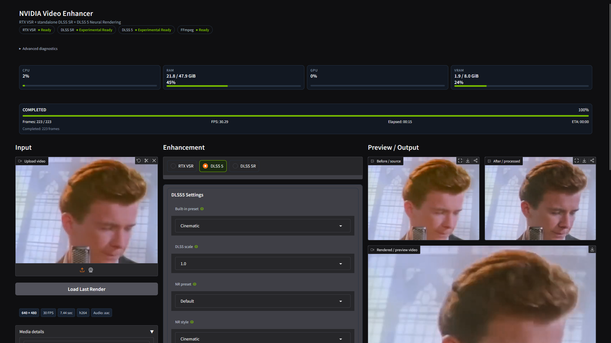
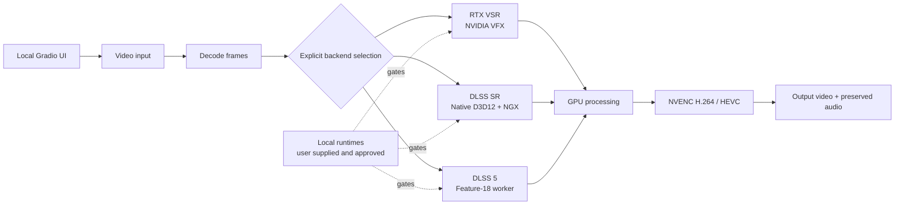

<div align="center">

# NVIDIA Video Enhancer

**A local Windows workbench for NVIDIA-powered video enhancement.**

Preview frames, preview clips, and render complete videos through three independent GPU backends. Your media stays on your machine.

[](https://www.microsoft.com/windows)
[](https://www.python.org/)
[](https://www.nvidia.com/geforce/graphics-cards/)
[](#security-model)
[](LICENSE)

**Unofficial community project. Not affiliated with or endorsed by NVIDIA.**

</div>

<div align="center">
  
</div>

## Choose Your Backend

The backends are selected explicitly. If a required runtime is missing or unapproved, that backend reports diagnostics and stops; it never silently switches to another processor.

| Backend | Best for | Starting point | Status |
| --- | --- | --- | --- |
| **RTX Video Super Resolution** | Ordinary video, compression artifacts, practical cleanup | 2× · ULTRA | Runtime-dependent |
| **DLSS Super Resolution** | Temporal super resolution through a native D3D12 host | Quality · Default model | Runtime-dependent |
| **DLSS 5 Neural Rendering** | CGI-like or AI-generated content where reinterpretation is acceptable | 1× native · Natural | Experimental |

### What each one does

- **RTX VSR** reconstructs and cleans up conventional video through NVIDIA's RTX Video SDK.
- **DLSS SR** runs standalone NVIDIA NGX DLSS Super Resolution with DIS optical-flow guidance. It is not a game integration and does not receive engine motion vectors.
- **DLSS 5** uses a separately supplied local Feature-18 worker. It is a neural rendering experiment, not a conventional detail-preserving upscaler; faces, materials, and lighting may be reinterpreted.

## Highlights

- Local Gradio UI bound to `127.0.0.1` with no public share link
- Before/after frame preview and short clip preview
- Full-video rendering with progress, GPU/VRAM monitoring, and cancellation
- H.264 or HEVC NVENC output in MP4, MKV, or MOV containers
- Audio preservation through the video render pipeline
- Saved settings and presets for each backend
- Separate runtime checks, diagnostics, manifests, hashes, and approval gates
- No backend fallback, silent proprietary-runtime downloads, or bundled NVIDIA binaries

## Architecture



## Quick Start

### 1. Install prerequisites

- Windows 10 or 11 x64
- NVIDIA GPU with a compatible NVIDIA driver
- Miniconda or Anaconda
- FFmpeg and FFprobe available on `PATH`

### 2. Clone and create the environment

From a Git-enabled terminal:

```bat
git clone --recurse-submodules https://github.com/jyu041/dlss-rtxsr-upscaler.git
cd dlss-rtxsr-upscaler
setup.bat
```

### 3. Launch the local UI

```bat
start.bat
```

Open the printed localhost URL, upload an owned or synthetic test video, choose one backend, preview a frame or clip, and then render. Start with the defaults shown in the comparison table before tuning a backend.

The detailed installation guide covers NVIDIA VFX, the local DLSS SDK staging path, and optional DLSS 5 approval requirements: [`docs/INSTALL.md`](docs/INSTALL.md).

## Requirements By Backend

| Backend | Additional local requirement |
| --- | --- |
| RTX VSR | Compatible official NVIDIA VFX package |
| DLSS SR | Locally staged NVIDIA DLSS SDK to build the host, approved `nvngx_dlss.dll`, and a passing self-test |
| DLSS 5 | Retained protocol client, separately obtained runtime, approved manifest, exact hashes, signed Feature-18 evidence, and the required Windows Firewall outbound block |

Backend availability depends on the installed GPU, driver, and exact runtime combination. RTX 30/40/50-series hardware may expose different capabilities; DLSS 5 support must not be inferred from community experiments alone. See [`docs/DLSS5_APPROVAL.md`](docs/DLSS5_APPROVAL.md) for the approval contract.

## Security Model

This project is designed for local, explicit, auditable processing:

- The UI binds to localhost and does not enable Gradio sharing.
- Proprietary NVIDIA runtimes, model weights, media, and worker packages are never silently downloaded or bundled.
- User-supplied runtimes are checked against configured provenance and hash rules where required.
- DLSS 5 requires explicit approval and a firewall outbound block for the worker.
- Missing, invalid, or unapproved runtimes fail closed with diagnostics.
- The application does not silently resize, sharpen, switch backends, or fetch replacement runtime files.

Read the full audit in [`docs/SECURITY_AUDIT.md`](docs/SECURITY_AUDIT.md).

## Limitations

- The current pipeline targets SDR RGBA video.
- DLSS SR uses estimated optical flow rather than engine-provided motion vectors and may fail around cuts, occlusion, hair, and transparency.
- DLSS 5 is experimental, hardware- and runtime-dependent, and may alter semantic content.
- Performance and output quality vary substantially by source media, codec, resolution, driver, and backend runtime.
- NVIDIA runtimes and community worker binaries remain subject to their own licenses and are not covered by this repository's MIT license.

## Tested Hardware

Primary development and hardware validation has been performed on:

- NVIDIA GeForce RTX 3070 8 GB
- Windows

This is a development and validation configuration, not a minimum requirement or a claim of official NVIDIA support for every backend. Backend availability depends on the installed GPU, driver, and exact runtime combination; in particular, this does not establish official DLSS 5 support on RTX 30-series hardware. GPU smoke tests count as validation only when the relevant local runtime is actually present.

For the validation classes and commands, see [`docs/TESTING.md`](docs/TESTING.md). A skipped hardware test is not a successful backend validation.

## Project Structure

```text
src/                    Python application and video pipelines
native/dlss_sr_host/    Standalone D3D12 DLSS SR host
tests/                  Deterministic and explicit hardware tests
docs/                   Installation, architecture, security, and approval notes
third_party/            Retained protocol dependency and local SDK staging area
setup.bat               Conda environment setup
start.bat               Local UI launcher
```

## Documentation

- [`docs/INSTALL.md`](docs/INSTALL.md) - installation and backend setup
- [`docs/ARCHITECTURE.md`](docs/ARCHITECTURE.md) - pipeline and host architecture
- [`docs/SECURITY_AUDIT.md`](docs/SECURITY_AUDIT.md) - security and runtime policy
- [`docs/DLSS5_APPROVAL.md`](docs/DLSS5_APPROVAL.md) - DLSS 5 provenance and approval
- [`docs/TESTING.md`](docs/TESTING.md) - deterministic and hardware validation
- [`docs/THIRD_PARTY.md`](docs/THIRD_PARTY.md) - dependency and retained-source licensing

## Acknowledgements

This project uses the following software and technologies; acknowledgement does not imply endorsement:

- NVIDIA for RTX Video Super Resolution, NGX DLSS, and related developer technologies
- The maintainers of the retained [`ComfyUI-DLSS5-Enhancer`](third_party/ComfyUI-DLSS5-Enhancer) protocol client
- FFmpeg for media decoding, encoding, and muxing
- Gradio for the local UI
- OpenCV for image and frame processing
- PyTorch for tensor and CUDA operations

This repository does not redistribute NVIDIA SDKs, runtimes, model files, or community worker binaries.

## License

Project-owned source is released under the [MIT License](LICENSE). Third-party components and proprietary runtimes retain their respective licenses. See [`docs/THIRD_PARTY.md`](docs/THIRD_PARTY.md) for the inventory.
