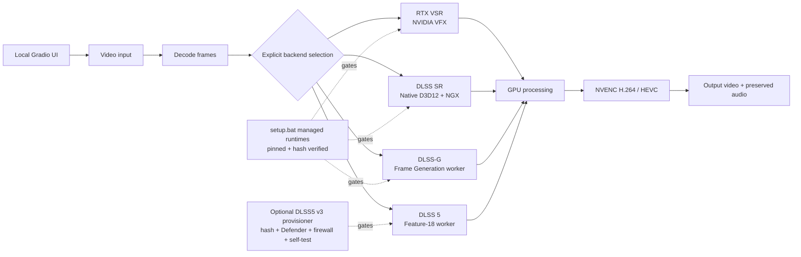

<div align="center">

# NVIDIA Video Enhancer

**A local Windows workbench for NVIDIA-powered video enhancement.**

Preview frames, preview clips, and render complete videos through four primary GPU backend families. Your media stays on your machine.

[](https://www.microsoft.com/windows)
[](https://www.python.org/)
[](https://www.nvidia.com/geforce/graphics-cards/)
[](#security-model)
[](LICENSE)

**Unofficial community project. Not affiliated with or endorsed by NVIDIA.**

</div>

<div align="center">
  
</div>

## Choose Your Backend

The backends are selected explicitly. If a required runtime is missing, incompatible, or unapproved, that backend reports diagnostics and stops; it never silently switches to another processor.

| Backend | Best for | Starting point | Setup state |
| --- | --- | --- | --- |
| **RTX Video Super Resolution** | Ordinary video, compression artifacts, practical cleanup | 2× · ULTRA | Python/VFX runtime installed by `setup.bat` |
| **DLSS Super Resolution** | Temporal super resolution through a native D3D12 host | Quality · Default model | Host/runtime installed and self-test attempted by `setup.bat` |
| **DLSS Frame Generation** | Temporal interpolation through the DLSS-G worker | 2× / 3× / 4× | Worker + validated SM86 direct-host runtime + NVIDIA provider installed and validated by `setup.bat` |
| **DLSS 5 Neural Rendering** | CGI-like or AI-generated content where reinterpretation is acceptable | 1× native · Natural | Experimental; optional managed v3 provisioning with explicit approval, firewall, and Feature-18 self-test gates |

### What each one does

- **RTX VSR** reconstructs and cleans up conventional video through NVIDIA's RTX Video SDK.
- **DLSS SR** runs standalone NVIDIA NGX DLSS Super Resolution with DIS optical-flow guidance. It is not a game integration and does not receive engine motion vectors.
- **DLSS-G** generates intermediate frames from consecutive decoded frames using NVIDIA Optical Flow, the project C55 worker, the pinned C55-validated SM86 direct-host runtime, and the pinned official NVIDIA provider. It is frame generation, not an upscaler.
- **DLSS 5** uses the validated experimental v3 Feature-18 worker when the user explicitly opts into provisioning and all identity, malware-scan, firewall, and self-test gates pass. It is a neural rendering experiment, not a conventional detail-preserving upscaler; faces, materials, and lighting may be reinterpreted.

## Highlights

- Local Gradio UI bound to `127.0.0.1` with no public share link
- Before/after frame preview and short clip preview
- Full-video rendering with progress, GPU/VRAM monitoring, and cancellation
- H.264 or HEVC NVENC output in MP4, MKV, or MOV containers
- Audio preservation through the video render pipeline
- Saved settings and presets for each backend
- Manifest-driven runtime downloads with pinned URLs, hashes, destinations, and validation gates
- Normal RTX VSR, DLSS SR, and DLSS-G use does not require manually downloading backend DLLs or entering executable paths in the UI
- DLSS 5 v3 can be provisioned from the same setup flow after an explicit opt-in; the user is not asked to hand-copy DLLs, calculate hashes, author `approval.json`, or create the firewall rule manually
- No backend fallback, silent runtime downloads at application startup, or unapproved proprietary binary substitution

## Architecture



## Quick Start

### Prerequisites

The source-checkout workflow assumes the following are already installed:

- **Windows 10/11 x64**
- **NVIDIA RTX GPU** with a current compatible NVIDIA Game Ready or Studio driver
- **Git for Windows** — current stable release recommended
- **Miniconda** — recommended; Anaconda is also supported
- **FFmpeg + FFprobe with NVENC** on `PATH` — a current full Gyan FFmpeg build is a known-good choice
- **Microsoft Visual C++ 2015-2022 Redistributable x64**

The project setup owns the Conda environment and managed backend files. Users should not need to collect backend executables/DLLs from other repositories or paste runtime paths into the normal UI.

Run `setup.bat` from a normal network-enabled terminal. Sandboxed automation shells that intentionally inject a local discard proxy such as `127.0.0.1:9` are rejected up front rather than bypassed or allowed to hang during Conda/runtime downloads.

### Install and run

From a Git-enabled terminal:

```bat
git clone --recurse-submodules https://github.com/jyu041/dlss-rtxsr-upscaler.git
cd dlss-rtxsr-upscaler
setup.bat
start.bat
```

`setup.bat` performs the provisioning step. The normal fresh-install contract is therefore **clone → setup → start**; no backend path entry is required in the UI. It:

1. creates or updates the dedicated `dlss-rtxsr-upscaler` Conda environment;
2. installs the pinned Python dependencies, including NVIDIA VFX and CUDA-enabled PyTorch;
3. verifies FFmpeg/FFprobe and H.264/HEVC NVENC support;
4. downloads and verifies the project-owned C55 DLSS-G worker and validated DLSS SR host/runtime from the public `v0.1.0-beta.2` release;
5. downloads and verifies the C55-validated SM86 direct-host runtime from pinned upstream commit `5f62ff44a9c08f9841fa605e7b7160f79ccd2c40`;
6. downloads the pinned official NVIDIA DLSS-G provider from the public Streamline release;
7. optionally provisions the validated experimental DLSS 5 v3 runtime after explicit user consent, including pinned archive/file verification, Authenticode inspection, a required Microsoft Defender scan, an exact outbound firewall block, local approval generation, and the synthetic Feature-18 self-test;
8. attempts the DLSS SR self-test and bounded DLSS-G 2X/3X/4X validation on the managed legacy direct-host profile;
9. runs diagnostics; and
10. writes `config/source_env.bat` so `start.bat` uses the managed runtime locations automatically.

All downloaded managed components are checked against source-controlled identity policy before activation. `setup.bat` is an explicit user-initiated network action; ordinary `start.bat` startup does not silently download or replace runtime files. DLSS 5 v3 is additionally opt-in because it remains experimental and its worker is executed only after the extra local security gates pass.

If DLSS 5 v3 is selected, setup downloads the pinned ~467 MB upstream archive once and keeps a verified copy under `runtime/cache/dlss5-v3/` so a later UAC, provisioning, or Feature-18 retry does not normally require another full download. The flow can request Windows elevation for the exact outbound firewall rule and requires Microsoft Defender to be available for the managed approval path.

Optional setup controls for unattended or repeat installs are:

```bat
set NVE_SETUP_DLSS5=1
setup.bat
```

Use `NVE_SETUP_DLSS5=0` to skip the DLSS 5 prompt. If the exact pinned v3.0 archive is already available, set `NVE_DLSS5_ARCHIVE=C:\\path\\to\\DLSS.5.Visual.Enhancer.v3.0.zip` before running setup; all hash, scan, firewall, approval, and self-test gates still apply.

If a hardware validation fails, setup keeps the other verified backends usable and reports the affected backend as unavailable/needs validation rather than asking the user to browse for a DLL. The Runtime Manager remains available for inspection, repair, updates, and experimental components. The newer SM86 `candidate-0.3.1` proxy generation remains available there for explicit research, but it is not substituted for the validated C55 direct-host profile.

Open the printed localhost URL, upload an owned or synthetic test video, choose one backend, preview a frame or clip, and then render. The UI prefers a ready RTX VSR backend for a fresh session instead of defaulting to experimental DLSS 5.

### Existing beta package

The public `v0.1.0-beta.2` release remains available as the validated pre-Phase-5 beta package. It already contains the C55 worker, DLSS SR host, and validated official DLSS SR runtime, but its application source predates the current `main` branch. New users should prefer the current source-checkout workflow above.

The detailed setup is documented in [`docs/INSTALL.md`](docs/INSTALL.md). Development notes are in [`docs/DEVELOPMENT.md`](docs/DEVELOPMENT.md).

## Requirements By Backend

| Backend | Additional local requirement after `setup.bat` |
| --- | --- |
| RTX VSR | Compatible GPU/driver; the pinned NVIDIA VFX Python package is installed by setup |
| DLSS SR | Compatible GPU/driver; host/runtime are installed automatically and setup attempts the local self-test |
| DLSS-G | Compatible GPU/driver; C55, the validated SM86 direct-host runtime, and official NVIDIA provider are installed automatically and setup attempts bounded 2X/3X/4X validation |
| DLSS 5 | Explicit opt-in to the managed v3 provisioner; setup verifies the pinned upstream runtime, requires a clean Defender scan, installs/verifies the outbound worker block, writes local approval, and runs the Feature-18 self-test |

Backend availability depends on the installed GPU, driver, and exact runtime combination. RTX 30/40/50-series hardware may expose different capabilities; DLSS 5 support must not be inferred from community experiments alone. See [`docs/DLSS5_APPROVAL.md`](docs/DLSS5_APPROVAL.md) for the approval contract.

## Managed Runtime Layout

A normal source installation uses canonical project paths such as:

```text
runtime/
├── dlss-sr-host/
│   ├── dlss_sr_host.exe
│   └── nvngx_dlss.dll
├── dlssg/
│   ├── worker/
│   │   └── dlssg_sm86_offline.exe
│   ├── legacy/                 # validated normal C55 direct-host profile
│   │   ├── version.dll
│   │   └── dlssg_sm86.ini
│   ├── candidate-0.3.1/        # optional experimental proxy candidate
│   │   ├── version.dll
│   │   └── dlssg_sm86.ini
│   └── official/
│       └── nvngx_dlssg.dll
└── dlss5-v3/                 # only when the user explicitly opts in
    ├── nvngx.dll
    ├── renodx-dlss5.addon64
    ├── nvngx_dlssnr.dll
    ├── dxgi.dll
    ├── nvngx_dlss.dll
    ├── approval.json         # local, gitignored
    └── selftest.json         # local, gitignored after a successful test
```

Advanced environment-variable overrides remain supported for development and validation, but they are not part of the normal user workflow.

## Security Model

This project is designed for local, explicit, auditable processing:

- The UI binds to localhost and does not enable Gradio sharing.
- `setup.bat` explicitly retrieves pinned managed components from their recorded public sources and verifies archive/file identities before activation.
- The project does **not** redistribute the externally licensed DLSS-G direct-host/provider files, the optional 0.3.1 candidate, or the DLSS 5 v3 runtime archive in the Git repository; setup/Runtime Manager downloads them directly from their recorded public upstream sources after the relevant user action.
- DLSS 5 v3 provisioning is opt-in and additionally requires exact five-file hashes, Authenticode inspection, a clean Microsoft Defender scan, a verified exact outbound firewall block for the worker, a local approval manifest, and successful Feature-18 self-test evidence.
- Ordinary application startup does not silently fetch or replace runtime files.
- Missing, invalid, incompatible, modified, or unapproved runtimes fail closed with diagnostics.
- The application does not silently resize, sharpen, switch backends, or fetch replacement runtime files.

Read the full audit in [`docs/SECURITY_AUDIT.md`](docs/SECURITY_AUDIT.md).

## Limitations

- The current pipeline targets SDR RGBA video.
- DLSS SR uses estimated optical flow rather than engine-provided motion vectors and may fail around cuts, occlusion, hair, and transparency.
- DLSS-G behavior remains hardware/runtime dependent; the normal Ampere path is pinned to the exact C55-validated direct-host runtime, while the newer 0.3.1 proxy generation is experimental rather than an automatic upgrade.
- DLSS 5 is experimental, hardware- and runtime-dependent, and may alter semantic content.
- The currently validated RTX 3070-family/Ampere v3 path is restricted to 1.0× output; higher v3 output scales remain blocked because the tested pairing reproducibly fell back with NGX `InvalidParameter (0xBAD00005)`.
- Visual Enhancer v10 is the newest Neuroframe static-only research candidate and is not substituted for the validated v3 Feature-18 execution path; the earlier v9 candidate is retained as historical static-audit evidence.
- Performance and output quality vary substantially by source media, codec, resolution, driver, and backend runtime.
- NVIDIA runtimes and community runtime files remain subject to their own licenses and are not covered by this repository's MIT license.

## Tested Hardware

Primary development and hardware validation has been performed on:

- Phase 4C / beta.2 validation: NVIDIA GeForce RTX 3070 Ti 8 GB, Windows 11
  build 26200, NVIDIA driver 610.62.
- DLSS-G direct-host validation on that RTX 3070 Ti passed the bounded 256×256
  **2X, 3X and 4X** matrix with both deterministic external motion vectors and
  NVIDIA Optical Flow, using the pinned `5f62ff44...` SM86 runtime profile.
- DLSS 5 v3 Feature-18 provisioning and hardware self-test also passed on the
  RTX 3070 Ti with the managed hash/Defender/firewall/approval gates in place;
  the validated Ampere execution path remains the experimental 1.0× mode.
- Other development testing also includes RTX 3070 where separately documented.

This is a development and validation configuration, not a minimum requirement or a claim of official NVIDIA support for every backend. Backend availability depends on the installed GPU, driver, and exact runtime combination; in particular, this does not establish official DLSS 5 support on RTX 30-series hardware. GPU smoke tests count as validation only when the relevant local runtime is actually present.

For the validation classes and commands, see [`docs/TESTING.md`](docs/TESTING.md). A skipped hardware test is not a successful backend validation.

## Project Structure

```text
src/                    Python application and video pipelines
native/dlss_sr_host/    Standalone D3D12 DLSS SR host
tests/                  Deterministic and explicit hardware tests
docs/                   Installation, architecture, security, and approval notes
third_party/            Retained protocol dependency and local SDK staging area
tools/provision_dlss5_v3.py  Explicit managed DLSS 5 v3 provisioning/security gate
setup.bat               Conda + managed runtime provisioning
start.bat               Local UI launcher
```

## Documentation

- [`docs/INSTALL.md`](docs/INSTALL.md) - installation and backend setup
- [`docs/ARCHITECTURE.md`](docs/ARCHITECTURE.md) - pipeline and host architecture
- [`docs/SECURITY_AUDIT.md`](docs/SECURITY_AUDIT.md) - security and runtime policy
- [`docs/DLSS5_APPROVAL.md`](docs/DLSS5_APPROVAL.md) - DLSS 5 provenance and approval
- [`docs/TESTING.md`](docs/TESTING.md) - deterministic and hardware validation
- [`docs/THIRD_PARTY.md`](docs/THIRD_PARTY.md) - dependency and retained-source licensing
- [`CONTRIBUTING.md`](CONTRIBUTING.md) - development and contribution guidelines

## Acknowledgements

This project uses the following software and technologies; acknowledgement does not imply endorsement:

- NVIDIA for RTX Video Super Resolution, NGX DLSS, Streamline, and related developer technologies
- The maintainers of the retained [`ComfyUI-DLSS5-Enhancer`](third_party/ComfyUI-DLSS5-Enhancer) protocol client
- The upstream SM86 DLSS-G project referenced by the managed runtime manifest
- FFmpeg for media decoding, encoding, and muxing
- Gradio for the local UI
- OpenCV for image and frame processing
- PyTorch for tensor and CUDA operations

Beta packaging may redistribute only the specifically validated DLSS SR application host and official REL runtime under the applicable NVIDIA terms. The source repository does not redistribute the managed external DLSS-G direct-host/provider files, the optional 0.3.1 candidate, or the DLSS 5 v3 release archive; `setup.bat` and Runtime Manager retrieve pinned files directly from their public upstream sources after explicit user action. The v10 Neuroframe runtime remains separately gated as static-only research; v9 is retained as historical static-audit evidence.

## License

Project-owned source is released under the [MIT License](LICENSE). Third-party components and proprietary runtimes retain their respective licenses. See [`docs/THIRD_PARTY.md`](docs/THIRD_PARTY.md) for the inventory.
